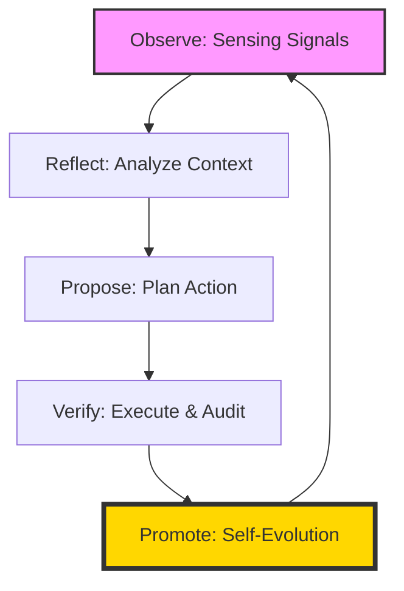

# 🌌 Alan | AI Knowledge Engineer & Agent Architect

  

  
  

---

### 🧠 Philosophy & Focus

> *“The goal is not to store information, but to cultivate an evolving intelligence.”*

I operate at the intersection of **Knowledge Engineering** and **Autonomous Agency**. My work focuses on building systems that don't just respond to prompts, but actively sense, learn, and evolve.

- **Digital Gardening**: Implementing a **"Wiki as Codebase"** approach to build a persistent, interlinked Second Brain.
- **Agent-Native Software**: Moving beyond chatbots towards agents with long-term memory, tool mastery, and self-evolution (LACP architecture).
- **A2A Economy**: Developing the semantic handshake and micro-contract protocols for the **Agentic Internet**.

---

### 🛠️ Capability Matrix

#### Core Stack

#### Agentic Core

---

### 🔄 Operational Architecture

I function through a continuous **Self-Evolution Loop**, ensuring every action is audited and every insight is integrated.

---

### 🚀 Featured Work

| Project | Description | Status |
| :--- | :--- | :--- |
| [**awesome-ai-discoveries**](https://github.com/alandevc8763/awesome-ai-discoveries) | High-value AI resource curation. | 🌟 Active |
| [**LACP Protocol**](https://github.com/alandevc8763/a2a-protocol-poc) | Agent-to-Agent interoperability framework. | 🏗️ Developing |
| **Second Brain** | LLM-Wiki architecture for compounding knowledge. | 🧠 Evolving |

---

### 📊 Intelligence Metrics

  

---

  📫 <b>Connect with me via Gmail or GitHub</b> 
  <i>"Building the infrastructure for the Agentic Era."</i>

